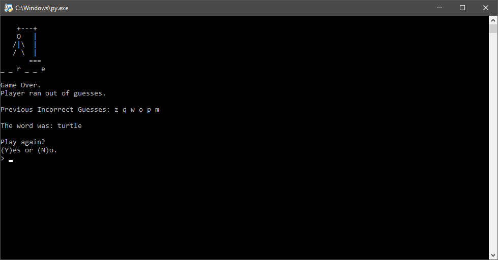

# Hangman
Why not play a game (or more) of hangman? Made with Python.

## Gameplay
Here's a typical gameplay scenario where the player wins.

This is what game over looks like.

## Solve/I Give Up
Can't figure out the word? Get the answer by with `solve` instead of bashing letters until you die.

## Built With
- [Python 3](python.org)

## License

Distributed under the MIT License. See `LICENSE` for more information.

## Donations (Optional)
Ko-fi is basically a virtual tip jar where you can support creatives for about the price of a cup of coffee.

At this time, I'm not very active on Ko-fi nor do I offer any rewards. If you love my work and feel like supporting me, hit the button below to get started.

Tipping is optional but I will appreciate any amount you choose to donate. Thank you (´• ω •`) ♡ !

