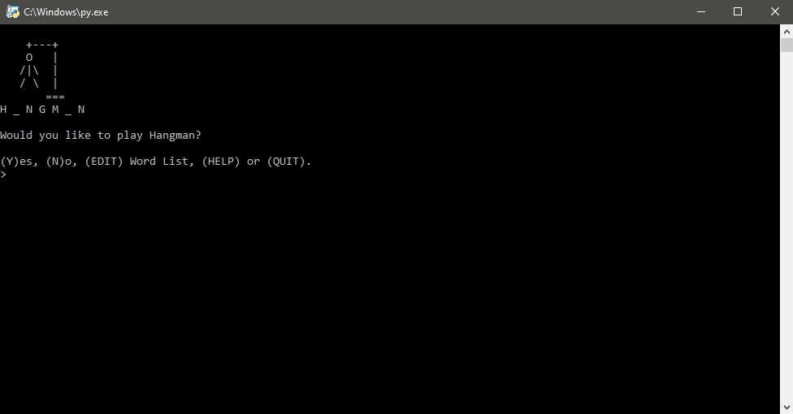
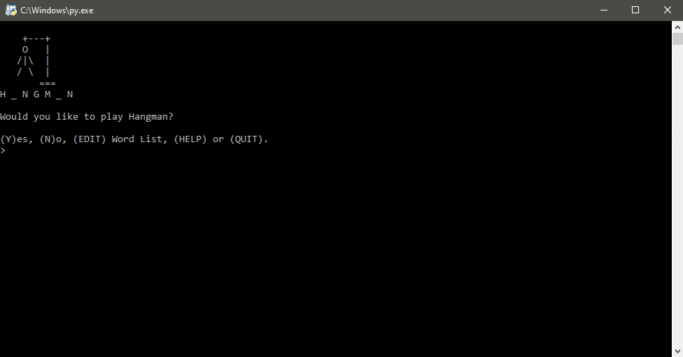
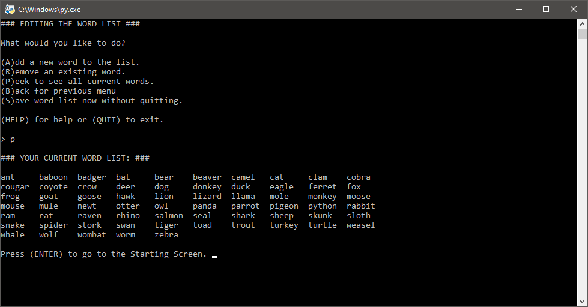

# Hangman
Why not play a game (or more) of Hangman? Made with Python. Play using the default word list of animals or add your own.

## Table of Contents
- [Gameplay](#Gameplay)
    - [Rules](#Rules)
    - [Winning](#Winning)
    - [Game Over](#Game-Over)
    - [Solve For Me/I Give Up](#Solve-For-Me/I-Give-Up)
    - [Not A Letter](#Not-A-Letter)
    - [Editing](#Editing)
- [Built With](#Built-With)
- [Running the Game](#Running-the-Game)
- [Changelog](#Changelog)
- [License](#License)
- [Acknowledgements](#Acknowledgements)
- [Donations (Optional)](#Donations-(Optional))

## Gameplay
You can play this game endlessly. For those who love CAPS, input is case-insensitive but will output as lowercase. See [Not A Letter](#Not-A-Letter) for what happens with invalid inputs. All words in the list are animals but fully customizable by the user, see [Editing](#Editing) to learn how.

### Rules
For those who have never played Hangman, the game requires two players. In this case, the computer is player number two. One player thinks of a secret word (in this case, the computer) while the other player (you) will try and guess the word by guessing the letters in it.

For every incorrect guess, a picture of a hanged stick man will be revealed. When the stick man is hanged, the game is over. To win, correctly guess the secret word and save the stick man from being hanged.

Type and enter `help` any time in the game to pull up the help menu.

### Winning
Here's a typical gameplay scenario where the player wins. The player wins when they correctly guess all the letters in whatever word the computer chooses.

Of course, you can play infinitely until you get bored without having to re-launch the game by typing `y` for "yes" at the end to trigger a new game. Each new word is chosen randomly from a list inside the Python file but you can make your own seperate custom word list (covered in [Editing](#Editing)).

### Game Over
This is what a Game Over scenario looks like. The ASCII stick man updates each time the player makes an incorrect guess. Just like the [winning scenario](#Winning), you can play again as many times as you want afterwards.

### Solve For Me/I Give Up
Can't figure out the word? Get the answer with `solve` instead of bashing each letter until you die. This also ends the game early if you would like to access the [Editing Menu](#Editing).

### Not A Letter
What happens when you try entering more than one character at a time or isn't a letter at all? Let's find out.

The good news is that the UPPERCASE and lowercase of the same letter count as the same guess. This means that you won't be penalized for guessing the same letter more than once by accident. Or accidentally inputing a number or special character like "!/?>&...".

Trying to guess more than one character at a time is cheating!

### Editing
You can call `edit` before and after a new game to add or remove words from the current list. This cannot be done while you are playing Hangman.

In Editing, you can add and remove words, peek at the full word list, and save a custom word list. The default word list can be found within the `hangman.py` file itself. It is a list of 65 different animals. If `hangman_words.txt` was not found or couldn't load properly, Hangman will continue to run using the default word list.

#### Adding Words
You can add as many words as you like so long as they do NOT contain:
- spaces
- symbols
- numbers or
- special characters.
Words must be added one at a time and have a minimum of two characters.

In the above example, the words "cookie" and "pie" were added, they are shown at the bottom of the word list in the final word list peek.

Your new word list will apply for the current game session, make sure to save it in the Editing Menu or when prompted at quitting for future sessions.

#### Removing Words
Don't like the default word list? You can remove any word you don't like from it.

In fact, you can "soft-delete" the entire default list and re-build a list from scratch if you wanted to. "Soft-delete" means that `hangman.py` will still re-use the default list upon relaunching unless you choose an empty `hangman_words.txt` to override it. In this case, you can delete the word-less `hangman_words.txt` file or use the [Editing Menu](#Editing) to add new words.

Your new word list will apply for the current game session, make sure to save it in the Editing Menu or when prompted at quitting for future sessions.

#### Peeking At Current Word List
Here are the 65 default animal names. Note: Newly added words will be added to bottom of the list. See [Adding Words](#Adding-Words) for adding new words.

#### Saving Words
Players will have the option to save the list from the Editing Menu and will be asked if they want to save again upon quitting.

When saving, the game will try to save a `hangman_words.txt` in the same location as the `hangman.py` file. While it is possible to check and edit the words in `hangman_words.txt` in a .txt reader, it isn't recommended. Opening `hangman_words.txt` won't cause any issues but it is written with special characters that make it possible for Python to import it back into the game if you're thinking about editing the list. See [Adding Words](#Adding-Words) and [Removing Words](#Removing-Words) to edit the word list.

Disclaimer: If you are sharing and using custom `hangman_words.txt` files from others, please ensure that it is from a trusted or authenticated source before downloading and running it.

## Built With
- [Python 3.8](python.org) with the help of the built-in modules:
    - os
    - random
    - pickle
    - sys

## Running the Game
- Install Python 3.6 or newer.
    - You can grab the latest copy from http://python.org.
- Download the `hangman.py`.
- Run `hangman.py` and enjoy.

## Changelog
August 17, 2020:
- Added this Changelog
- Changed list name `animals` to `words` in Python file
- Added ability to add, remove, see the full word list and save new words locally
- Added a help screen
- Updated README images of gameplay and features to reflect new changes

## License 
Distributed under the MIT License. See `LICENSE` for more information.

## Acknowledgements
- [Invent With Python](https://inventwithpython.com/invent4thed/chapter8.html) for getting the main code off the ground.

## Donations (Optional)
Ko-fi is basically a virtual tip jar where you can support creatives for about the price of a cup of coffee.

At this time, I'm not very active on Ko-fi nor do I offer any rewards. If you love my work and feel like supporting me, hit the button below to get started.

Tipping is optional but I will appreciate any amount you choose to donate. Thank you (´• ω •`) ♡ !

