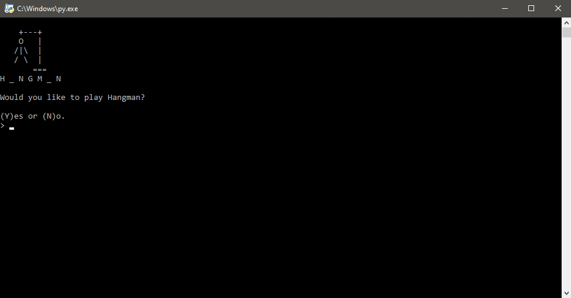
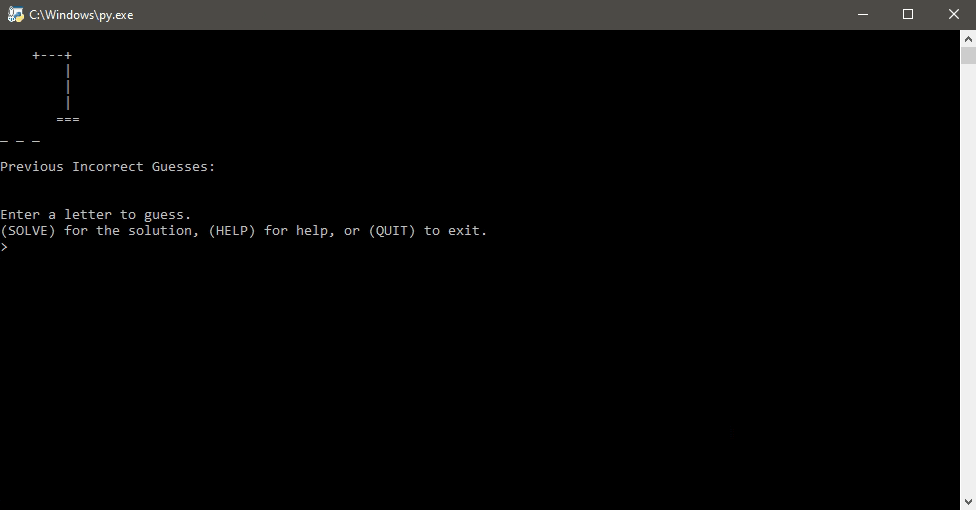
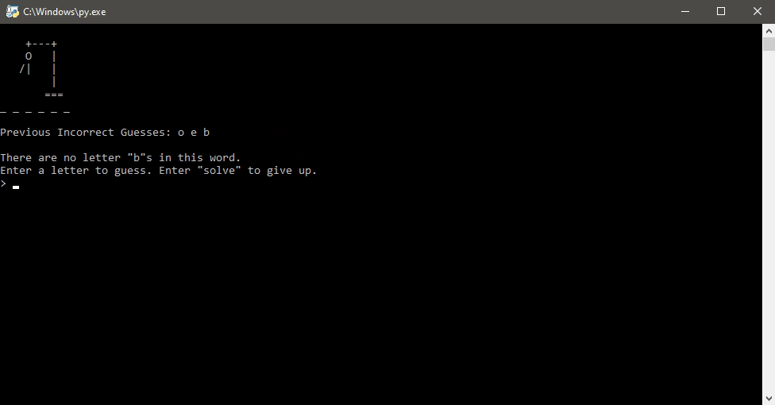
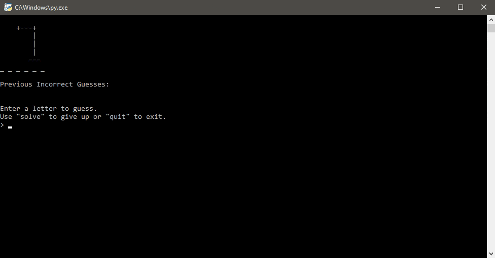

# Hangman
Why not play a game (or more) of Hangman? Made with Python.

## Table of Contents
- [Gameplay](#Gameplay)
- [Built With](#Built-With)
- [Requirements](#Requirements)
- [License](#License)
- [Donations (Optional)](#Donations-(Optional))

## Gameplay
You can play this game endlessly. For those who love CAPS, input is case-insensitive but will output as lowercase. See [Not A Letter](#Not-A-Letter) for invalid inputs. All words in the list are animals.

### Rules
For those who have never played Hangman, the game requires two players. In this case, the computer is the second player. One player thinks of a word (in this case, the computer), the other player (you) will try to guess the word by guessing the letters in it. For every wrong guess, a picture of a hanged stick man will be revealed until the stick man is hanged. Then it is game over. You win by correctly guessing the thought up word.

### Winning
Here's a typical gameplay scenario where the player wins. The player wins when they correctly guess all the letters in whatever word the computer chooses.

Of course, you can play infinitely until you get bored. Each new word is chosen randomly from a list (inside the Python file).

### Game Over
This is what Game Over looks like. Just like the [winning scenario](#Winning), you can play again as many times as you want afterwards.

### Solve For Me/I Give Up
Can't figure out the word? Get the answer by with `solve` instead of bashing each letter until you die.

### Not A Letter
What happens when you try entering more than one character that's not a letter? Let's find out.

The good news is that UPPERCASE and lowercase of the same letter count as the same guess meaning that you won't be penalized for guessing the same letter by accident. Or accidentally inputing a number or special character like "!".

Trying to guess more than one character at a time is cheating!

## Built With
- [Python 3.8](python.org)

## Requirements
- Python 3.6 or newer

## License

Distributed under the MIT License. See `LICENSE` for more information.

## Acknowledgements
- [Invent With Python](https://inventwithpython.com/invent4thed/chapter8.html) for getting the main code off the ground.

## Donations (Optional)
Ko-fi is basically a virtual tip jar where you can support creatives for about the price of a cup of coffee.

At this time, I'm not very active on Ko-fi nor do I offer any rewards. If you love my work and feel like supporting me, hit the button below to get started.

Tipping is optional but I will appreciate any amount you choose to donate. Thank you (´• ω •`) ♡ !

